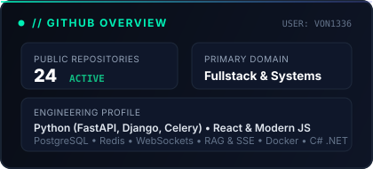
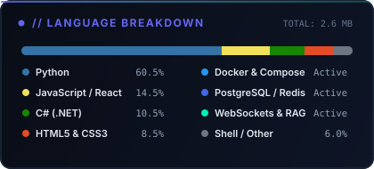

# Hi there, I'm von1336 👋

Full-Stack разработчик и системный инженер. Специализируюсь на надежных серверных архитектурах на Python (FastAPI, Django, Celery), реалтайм-системах, десктопе на C# .NET/WPF и интерактивной веб-графике на Canvas 2D/3D.

> 🚀 **[Интерактивное портфолио и лаборатория архитектуры](https://von1336.github.io/interactive-web-showcase/)**  
> Интерактивный хаб со всеми проектами, живым поиском, 3D Canvas, процедурным звуком и глубоким разбором архитектуры:  
> 👉 **[von1336.github.io/interactive-web-showcase](https://von1336.github.io/interactive-web-showcase/)**

---

## ⚡ Ключевые компетенции

- **Backend & High-Load:** Python (FastAPI, Django 5, Celery), Node.js (Express), Redis, PostgreSQL, Docker Compose. Атомарные транзакции (`select_for_update`), ликвидация N+1 запросов, асинхронные очереди и отказоустойчивые кэши.
- **AI & Real-Time:** RAG-архитектуры (векторный поиск ChromaDB / Qdrant), потоковая генерация SSE с низкой задержкой, многопользовательские WebSockets с шиной Redis Pub/Sub.
- **Desktop & Автоматизация:** C# / .NET / WPF десктоп-лаунчеры с автообновлением через GitHub Releases API, Telegram-боты на aiogram 3.x, устойчивые парсеры данных (BS4, HTTP-пулы, ретраи).
- **Frontend & Интерактив:** React 18/19, чистый JavaScript (ES6+ Zero-Build), интерактивный 2D/3D Canvas (60 FPS, физика Кеплера, системы частиц) и процедурный синтез Web Audio API.

---

## 🏛️ Проекты и репозитории

| Проект | Стек | Описание |
| :--- | :--- | :--- |
| **[fastapi-rag-ai-assistant](https://github.com/von1336/fastapi-rag-ai-assistant)** | `FastAPI` `ChromaDB` `SSE` `Docker` | AI-ассистент с RAG-поиском по базе знаний, потоковыми ответами (SSE) и rate limiting |
| **[fastapi-kanban-board-realtime](https://github.com/von1336/fastapi-kanban-board-realtime)** | `FastAPI` `WebSockets` `Redis` `PostgreSQL` | Real-time канбан-доска с мгновенной синхронизацией через WebSockets и шину Redis Pub/Sub |
| **[django-ecommerce-api-backend](https://github.com/von1336/django-ecommerce-api-backend)** | `Django 5` `DRF` `Celery` `PostgreSQL` | Энтерпрайз e-commerce бэкенд: атомарный резерв товаров (`select_for_update`), Celery-очереди |
| **[aiohttp-celery-news-aggregator](https://github.com/von1336/aiohttp-celery-news-aggregator)** | `aiohttp` `Celery` `Redis` `PostgreSQL` | Асинхронный конвейер сбора новостей: параллельный сбор фидов, дедупликация в Redis |
| **[tg-ads-parser](https://github.com/von1336/tg-ads-parser)** | `Python` `aiogram 3` `GPT-5` `SQLite WAL` | Бот-охотник за заказами с 10+ бирж с ИИ-генерацией откликов через GPT-5 по кнопке |
| **[interactive-web-showcase](https://github.com/von1336/interactive-web-showcase)** | `Canvas 2D/3D` `Web Audio` `Vanilla JS` | Сюита из 5 веб-миров: 3D частицы, турбийон 4Hz, орбиты Кеплера и процедурное аудио |
| **[hermes-installer](https://github.com/von1336/hermes-installer)** | `C#` `.NET` `WPF` `GitHub API` | Десктопный Windows-лаунчер с автообновлением версий через GitHub Releases API |
| **[autogit_pro](https://github.com/von1336/autogit_pro)** | `Python` `CustomTkinter` `Git CLI` | GUI-комбайн для автоматизации GitHub: массовая загрузка папок, коммиты, управление ветками |
| **[von-procurement-platform](https://github.com/von1336/von-procurement-platform)** | `Django 5` `Celery` `Redis` `Docker` | B2B платформа корпоративных закупок: тендеры, импорт прайсов и аудит документов |
| **[cbr-currency-tracker-bot](https://github.com/von1336/cbr-currency-tracker-bot)** | `Python` `aiogram 3` `XML API` `SQLite` | Мониторинг курсов ЦБ РФ с алертами при резких скачках волатильности и дайджестами |
| **[hh-vacancy-parser](https://github.com/von1336/hh-vacancy-parser)** | `Python` `HH.ru API` `PostgreSQL` `Asyncio` | Парсер вакансий hh.ru с нормализацией мультивалютных вилок и идемпотентным upsert в БД |
| **[telegram-task-manager-bot](https://github.com/von1336/telegram-task-manager-bot)** | `python-telegram-bot` `JobQueue` `SQLAlchemy` | Персональный таск-менеджер в Telegram с напоминаниями точно в срок через JobQueue |
| **[fastapi-shop-catalog-api](https://github.com/von1336/fastapi-shop-catalog-api)** | `FastAPI` `SQLAlchemy 2.0` `Pydantic v2` | Асинхронный каталог товаров с фасетной фильтрацией, пагинацией и OpenAPI 3.1 |
| **[django-blog-rest-api](https://github.com/von1336/django-blog-rest-api)** | `Django 5` `DRF` `PostgreSQL` `Token Auth` | REST API для медиа: древовидные комментарии, драфты, объектные права доступа |
| **[react-dashboard](https://github.com/von1336/react-dashboard)** | `React 18` `Vite` `Recharts` `Tailwind` | Аналитический дашборд с интерактивными графиками финансовых показателей и темной темой |
| **[web-scraper](https://github.com/von1336/web-scraper)** | `BeautifulSoup4` `Pandas` `OpenPyXL` | Модульный скрапер с обходом пагинации, ретраями и экспортом в CSV/Excel |
| **[vk-to-yadisk-backup](https://github.com/von1336/vk-to-yadisk-backup)** | `Python` `VK API` `Yandex.Disk REST` | Облачный бэкап медиа из VK в Яндекс.Диск с сохранением максимального качества |
| **[ecommerce-api](https://github.com/von1336/ecommerce-api)** | `Node.js` `Express` `SQLite` `JWT` | Легковесный e-commerce микросервис: авторизация по токенам, каталог, корзина |
| **[contact-manager-cli](https://github.com/von1336/contact-manager-cli)** | `Python` `PostgreSQL` `Psycopg2` | CLI адресной книги с защитой от SQLi (параметризованные запросы) и экспортом |
| **[flask-notes-jwt-api](https://github.com/von1336/flask-notes-jwt-api)** | `Flask` `JWT` `Flask-Limiter` `SQLite` | Защищенный API заметок с тегами, поиском и ограничением нагрузки (Rate Limiting) |
| **[flask-url-shortener](https://github.com/von1336/flask-url-shortener)** | `Flask` `Base62` `SSRF Defense` | Сервис коротких ссылок с Base62-кодированием, защитой от SSRF и счетчиками кликов |
| **[portfolio-site](https://github.com/von1336/portfolio-site)** | `Vanilla JS` `CSS3` `HTML5` | Адаптивный сайт-портфолио в темной теме с терминальной hero-секцией |

---

## 🛠️ Стек технологий

**Backend & Storage:**  

**Frontend & Visuals:**  

**Systems & Automation:**  

---

## 📊 Статистика активности

  
  

  

---

## 📬 Контакты

- **Telegram:** [@simulcra](https://t.me/simulcra)
- **GitHub:** [@von1336](https://github.com/von1336)
- **Live Showcase:** [von1336.github.io/interactive-web-showcase](https://von1336.github.io/interactive-web-showcase/)
